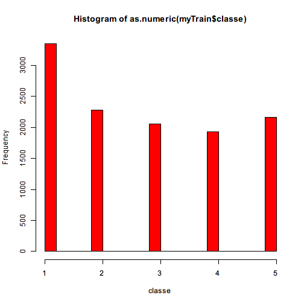
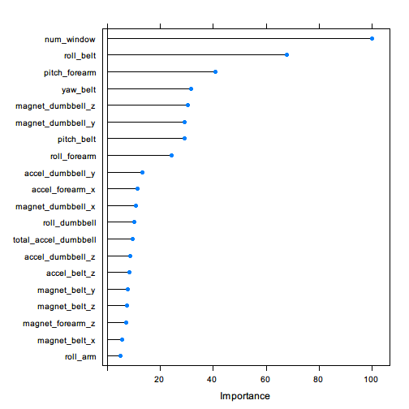

## Synopsis

The goal of the project is to predict the manner-"classe" variable using other variables based on the provided sensor data sets from "http://groupware.les.inf.puc-rio.br/har".
The data was processed and cleaned first. After that, three models (including rpart, randomforest and gbm) have been evaluated. We concluded that Randomforest model has the best accuracy among them and it was applied to a blind test data set to predict the manner-"classe" variable.

## Data processing

First, the train and final blind test data set were loaded to "train_data" and "blind_test", assuming the downloaded files are in the working directory.

```r
train_data <- read.csv("pml-training.csv", na.strings=c("NA","#DIV/0!", "")) 
blind_test <- read.csv("pml-testing.csv", na.strings=c("NA","#DIV/0!", ""))
```

Then, the train data were split to a training data set (60%) and a testing data set (40%): "myTrain" and "myTest".

```r
library(caret)
set.seed(1)
myTrain_index <- createDataPartition(y = train_data$classe, p = 0.6, list = FALSE)
myTrain <- train_data[myTrain_index, ]
myTest <- train_data[-myTrain_index, ]
```


There are a lot of "NA" columns and varaiables which cannot be used for fitting, so those data points were removed before the fitting.

```r
# remove the index, user id, timestamp etc.
myTrain <- myTrain[,-(1:6)]
myTest <- myTest[,-(1:6)]
blind_test <- blind_test[,-(1:6)]

# remove the columns with all "NA"s
myTrain <- myTrain[,colSums(is.na(myTrain)) == 0]
myTest <- myTest[,colSums(is.na(myTest)) == 0]
blind_test <- blind_test[,colSums(is.na(blind_test)) == 0]
```

"classe" variable is checked in the cleaned training data set by histogram. The 5 classes A-E seems to distribute reasonablly even in the data set.


```r
hist(as.numeric(myTrain$classe), col = "red", xlab="classe")
```



## Model selection and accuracy analysis

3 models were tested, "rpart", "randomforest" and "gbm", with 5-fold cross validation. To avoid overfitting, the "PCA" option is enabled for data preprocessing. 


```r
library(randomForest)
library(rpart)
library(gbm)
library(plyr)

# 5-fold cross validation, PCA for data preprocessing, and parallel for speed up
set.seed(3)
tr_cntl = trainControl(method = "cv", number = 5, preProcOptions = "pca", allowParallel = TRUE)

# rpart model
set.seed(5)
model_rpart <- train(classe ~ ., data = myTrain, method = "rpart", trControl = tr_cntl, na.action = na.omit)

# randomforest model
set.seed(7)
model_rf <- train(classe ~ ., data = myTrain, method = "rf", trControl = tr_cntl, na.action = na.omit)

#gbm model
set.seed(9)
model_gbm <- train(classe ~ ., data = myTrain, method = "gbm", trControl = tr_cntl, na.action = na.omit)
```

Then the 3 models were applied on the testing data set for comparing the corresponding accuracy. 

```r
# predict for the testing set
predict_rpart <- predict(model_rpart, myTest)
predict_rf <- predict(model_rf, myTest)
predict_gbm <- predict(model_gbm, myTest)
# accuracy for testing set
a1 <- confusionMatrix(myTest$classe, predict_rpart)$overall[1]
a2 <- confusionMatrix(myTest$classe, predict_rf)$overall[1]
a3 <- confusionMatrix(myTest$classe, predict_gbm)$overall[1]


# predict for the training set
train_rpart <- predict(model_rpart, myTrain)
train_rf <- predict(model_rf, myTrain)
train_gbm <- predict(model_gbm, myTrain)
# accuracy for training set
b1 <- confusionMatrix(myTrain$classe, train_rpart)$overall[1]
b2 <- confusionMatrix(myTrain$classe, train_rf)$overall[1]
b3 <- confusionMatrix(myTrain$classe, train_gbm)$overall[1]

# summerize the accuracy to a table
sum_table <- data.frame(Model = c("rpart", "randomForest", "gbm"))
sum_table$Testing_Accuracy <- c(a1, a2, a3)
sum_table$Training_Accuracy <- c(b1, b2, b3)

library(knitr)
kable(sum_table, format = "markdown", align = 'l')
```


|Model        |Testing_Accuracy |Training_Accuracy |
|:------------|:----------------|:-----------------|
|rpart        |0.5219220        |0.5259001         |
|randomForest |0.9975784        |1.0000000         |
|gbm          |0.9871272        |0.9923573         |

Therefore, we found randomforest model has the best fitting accuracy, then is gbm. rpart is the worst model in terms of fitting accuracy. Randomforest model is selected for the prediction for the blind test data set. gbm is also a good one with very good accuracy.

The top 20 variables of the randomforest model were ploted here:

```r
plot(varImp(model_rf), top = 20)
```



## Prediction result

Finally, randomforest model were applied to the blind test data set to predict the "classes":

```r
blind_rf_predict <- predict(model_rf, blind_test)
```

We also compared the prediction result to the the gbm model and rpart model:

```r
blind_rpart_predict <- predict(model_rpart, blind_test)
blind_gbm_predict <- predict(model_gbm, blind_test)

kable(cbind("randomForest" = blind_rf_predict, "gbm" = blind_gbm_predict, 
            "rpart" = blind_rpart_predict), 
            format = "markdown", align = 'l')
```


|randomForest |gbm |rpart |
|:------------|:---|:-----|
|2            |2   |3     |
|1            |1   |1     |
|2            |2   |3     |
|1            |1   |1     |
|1            |1   |1     |
|5            |5   |3     |
|4            |4   |3     |
|2            |2   |1     |
|1            |1   |1     |
|1            |1   |1     |
|2            |2   |3     |
|3            |3   |3     |
|2            |2   |3     |
|1            |1   |1     |
|5            |5   |3     |
|5            |5   |1     |
|1            |1   |1     |
|2            |2   |1     |
|2            |2   |1     |
|2            |2   |3     |

So although randomforest model has a little better accuracy (0.998), it produced the same prediction as gbm model (accuracy ~ 0.987).

## Conclusion

Randomforest model has the best accuracy for prediction, ~0.998 on the testing data, within the three models evaluated. However, gbm also produced the same prediciton on the blind test data set.


###Thanks!
